# 🌙 Hello World! I'm Raghav Arora

<div align="center">
  


[](https://git.io/typing-svg)


<div align="center">
  
  
  
  
</div>

</div>

---

<div align="center">

</div>

##  About Me


```python
class RaghavArora:
    def __init__(self):
        self.name = "🚀 Raghav Arora"
        self.location = "🏢 Gurugram, India 🇮🇳"
        self.education = "🎓 BCA (AI & DS) @ K.R. Mangalam University"
        self.current_focus = [
            "🤖 Artificial Intelligence", 
            "🔐 Cybersecurity", 
            "🌐 Full Stack Development"
        ]
        self.languages = ["🇺🇸 English", "🇮🇳 Hindi"]
        
    def current_status(self):
        return {
            "🎓": "Final Year BCA Student (CGPA: 7.77/10)",
            "💼": "Ex-Cybersecurity Intern @ Placify",
            "🔍": "Open to AI/ML & Cybersecurity Opportunities",
            "🌱": "Learning Advanced Deep Learning & Cloud Security",
            "⚡": "Built AI system with 90% emotion detection accuracy!",
            "🏆": "Reduced security vulnerabilities by 30% in internship"
        }
    
    def get_skills(self):
        return {
            "💻 languages": ["Python", "C++", "Java", "R", "SQL"],
            "🤖 ai_ml": ["TensorFlow", "PyTorch", "OpenCV", "Pandas", "NumPy"],
            "🌐 web": ["Flask", "HTML", "CSS", "JavaScript"],
            "☁️ cloud": ["AWS", "Azure", "Power BI"],
            "🛡️ security": ["Penetration Testing", "Network Analysis"],
            "🛠️ tools": ["Git", "PyCharm", "MySQL", "Excel"]
        }
    
    def future_goals(self):
        return [
            "🎯 Secure AI/ML Engineer role",
            "📚 Publish research on AI threat detection", 
            "🌟 Contribute to major open-source projects",
            "🏅 Earn AWS & CEH certifications",
            "🚀 Launch AI-powered cybersecurity startup"
        ]
```

<div align="center">

</div>

---

##  Tech Stack & Arsenal

<div align="center">

###  Programming Languages
<div align="center">


</div>

###  AI/ML & Data Science
<div align="center">


</div>

###  Web Development
<div align="center">


</div>

###  Cloud & DevOps
<div align="center">


</div>

###  Cybersecurity
<div align="center">


</div>

###  Databases & BI Tools
<div align="center">


</div>

###  Development Tools
<div align="center">


</div>

</div>

<div align="center">

</div>

---

##  GitHub Analytics & Stats

<div align="center">
  


</div>

<div align="center">

</div>

---

##  Featured Projects & Achievements

<div align="center">

### 🎭 [Emotion-Based Music Recommendation System](https://github.com/Raghav2804/emotion-music-recommender)
<div align="center">

</div>

<div align="center">


</div>

**🔥 Key Highlights:**
- 🤖 **Real-time facial emotion detection** using OpenCV & deep learning
- 🎯 **90% accuracy** in mood classification across 7 emotions
- ⏱️ **80% reduction** in manual playlist curation time
- 👥 **50+ test users** with personalized music recommendations
- 🚀 **Live demo** with webcam integration

---

### 📚 [Student Performance Prediction System](https://github.com/Raghav2804/student-performance-predictor)
<div align="center">

</div>

<div align="center">


</div>

**🎯 Impact Metrics:**
- 📊 **500+ student records** analyzed with advanced ML algorithms
- 🎯 **85% prediction accuracy** using ensemble methods
- ⏰ **10 hours monthly** saved for educational institutions
- 📈 **Interactive dashboards** for real-time performance tracking
- 🔬 **Feature importance analysis** for educational insights

---

### 🌍 [Real-Time Multi-Language Translator](https://github.com/Raghav2804/language-translator)
<div align="center">

</div>

<div align="center">


</div>

**🚀 Advanced Features:**
- 🌐 **5 languages** supported with neural translation
- ⚡ **Real-time processing** with < 2s response time
- 🔢 **100+ daily translations** processed efficiently
- 💡 **70% time reduction** in manual translation tasks
- 🎨 **Modern UI/UX** with responsive design

---

### 💰 [AI-Powered Finance Tracker](https://github.com/Raghav2804/finance-tracker)
<div align="center">

</div>

<div align="center">


</div>

**💎 Smart Features:**
- 🧠 **AI-powered** expense categorization & fraud detection
- ✅ **75% accuracy** in financial article verification
- 🔗 **Multi-source validation** with 3 trusted financial APIs
- 📉 **20% reduction** in false positive alerts
- 📊 **Interactive dashboards** with predictive analytics

</div>

<div align="center">

</div>

---

##  Professional Experience

<div align="center">

### 🛡️ **Cybersecurity Intern** @ **Placify** (June-August 2024)


<table align="center">
<tr>
<td align="center">

</td>
<td align="center">

</td>
</tr>
<tr>
<td align="center">
• Comprehensive security assessments<br/>
• Critical vulnerability identification<br/>
• Security patch implementation<br/>
• Risk assessment & mitigation
</td>
<td align="center">
<strong>🎯 20+ vulnerabilities</strong> detected<br/>
<strong>🛡️ 30% reduction</strong> in risk exposure<br/>
<strong>✅ 100% success rate</strong> in patch deployment<br/>
<strong>🏆 Zero breaches</strong> during tenure
</td>
</tr>
</table>

<table align="center">
<tr>
<td align="center">

</td>
<td align="center">

</td>
</tr>
<tr>
<td align="center">
• Real-time traffic monitoring<br/>
• Advanced threat detection<br/>
• Security protocol implementation<br/>
• Multi-factor authentication setup
</td>
<td align="center">
<strong>🚨 15+ threats</strong> neutralized<br/>
<strong>🔒 25% security boost</strong> achieved<br/>
<strong>👥 All employee accounts</strong> secured<br/>
<strong>⚡ Real-time monitoring</strong> implemented
</td>
</tr>
</table>

</div>

<div align="center">

</div>

---

##  Certifications & Achievements

<div align="center">


### 🏆 **Professional Certifications**

<div align="center">
<table>
<tr>
<td align="center">

</td>
<td align="center">
<strong>Google</strong><br/>
AI-powered productivity & automation
</td>
</tr>
<tr>
<td align="center">

</td>
<td align="center">
<strong>IIT Delhi</strong><br/>
Chatbot development & AI deployment
</td>
</tr>
<tr>
<td align="center">

</td>
<td align="center">
<strong>IBM</strong><br/>
Data visualization & statistical analysis
</td>
</tr>
<tr>
<td align="center">

</td>
<td align="center">
<strong>IBM</strong><br/>
Machine learning & NLP techniques
</td>
</tr>
<tr>
<td align="center">

</td>
<td align="center">
<strong>IBM</strong><br/>
System security & threat identification
</td>
</tr>
</table>
</div>

### 🌟 **Academic Achievements**

<div align="center">


</div>

</div>

<div align="center">

</div>

---

##  Contribution Graph & Activity

<div align="center">
  
</div>

<div align="center">

</div>

---

##  Current Goals & Future Roadmap

<div align="center">




</div>

```mermaid
graph TD
    A[🎓 Complete BCA DegreeCGPA: 7.77+] --> B[🚀 Advanced AI SpecializationDeep Learning & Computer Vision]
    B --> C[🔒 Cybersecurity MasteryEthical Hacking & Threat Analysis]
    C --> D[☁️ Cloud Architecture ExpertiseAWS Solutions Architect]
    D --> E[🌟 Tech Leadership RoleAI/ML Team Lead]
    E --> F[🚀 Startup FounderAI-Powered Cybersecurity]
    
    A --> G[📚 Research PublicationAI Threat Detection]
    B --> H[🏅 Industry CertificationsAWS, CEH, CISSP]
    C --> I[🌐 Open Source Contributions5+ Major Projects]
    
    style A fill:#FF6B6B,stroke:#fff,stroke-width:3px,color:#fff
    style B fill:#4ECDC4,stroke:#fff,stroke-width:3px,color:#fff
    style C fill:#45B7D1,stroke:#fff,stroke-width:3px,color:#fff
    style D fill:#96CEB4,stroke:#fff,stroke-width:3px,color:#fff
    style E fill:#FECA57,stroke:#fff,stroke-width:3px,color:#fff
    style F fill:#FF9FF3,stroke:#fff,stroke-width:3px,color:#fff
    style G fill:#A8E6CF,stroke:#fff,stroke-width:2px,color:#fff
    style H fill:#FFB6C1,stroke:#fff,stroke-width:2px,color:#fff
    style I fill:#DDA0DD,stroke:#fff,stroke-width:2px,color:#fff
```

### 🎯 **2025 Objectives & Milestones**

<div align="center">
<table>
<tr>
<td align="center">

</td>
<td align="center">
Publish research paper on<br/>
<strong>"AI-Based Threat Detection in Cybersecurity"</strong>
</td>
<td align="center">

</td>
</tr>
<tr>
<td align="center">

</td>
<td align="center">
Secure full-time role as<br/>
<strong>AI/ML Engineer or Security Analyst</strong>
</td>
<td align="center">

</td>
</tr>
<tr>
<td align="center">

</td>
<td align="center">
Contribute to 5+ major<br/>
<strong>Open-source AI/Security projects</strong>
</td>
<td align="center">

</td>
</tr>
<tr>
<td align="center">

</td>
<td align="center">
Master Advanced Deep Learning<br/>
<strong>& Cloud Security Architecture</strong>
</td>
<td align="center">

</td>
</tr>
<tr>
<td align="center">

</td>
<td align="center">
Earn <strong>AWS Solutions Architect</strong><br/>
& <strong>Certified Ethical Hacker (CEH)</strong>
</td>
<td align="center">

</td>
</tr>
</table>
</div>

### 🚀 **Long-term Vision (2025-2030)**

<div align="center">


**Building the future of intelligent security systems through AI innovation**
</div>

<div align="center">

</div>

---

##  Let's Connect & Collaborate

<div align="center">


### 🌐 **Find Me Online**

<div align="center">
<a href="https://www.linkedin.com/in/raghav-arora-6662ab291/">

</a>
<a href="https://github.com/Raghav2804">

</a>
<a href="mailto:iamraghav28@gmail.com">

</a>
<a href="tel:+919311025740">

</a>
</div>

### 💬 **Open for Discussion On:**

<div align="center">
<table>
<tr>
<td align="center">

</td>
<td align="center">

</td>
</tr>
<tr>
<td align="center">

</td>
<td align="center">

</td>
</tr>
<tr>
<td align="center">

</td>
<td align="center">

</td>
</tr>
</table>
</div>

### 📧 **Quick Contact**

<div align="center">
<table>
<tr>
<td align="center">

</td>
</tr>
<tr>
<td align="center">

</td>
</tr>
<tr>
<td align="center">

</td>
</tr>
</table>
</div>

<div align="center">


<em><b>🌟 I love connecting with different people</b> so if you want to say <b>hi, I'll be happy to meet you more!</b> 🌟</em>
</div>

</div>

<div align="center">

</div>

---

##  Fun Facts & Personal Touch

<div align="center">


### 🎮 **When I'm Not Coding...**

<div align="center">
<table>
<tr>
<td align="center">

</td>
<td align="center">

</td>
</tr>
<tr>
<td align="center">

</td>
<td align="center">

</td>
</tr>
</table>
</div>

### ⚡ **Interesting Facts:**

- 🎭 Built an AI that can read your mood through your face with 90% accuracy!
- 🔐 Detected 20+ security vulnerabilities during my internship
- 🌍 Created a translator that processes 100+ translations daily
- 🤖 Can code in 5+ programming languages fluently
- 📊 Reduced manual work by 70-80% through automation in all my projects
- 🎓 Maintaining 7.77 CGPA while working on multiple projects

</div>

<div align="center">

</div>

---

<div align="center">

### 🌟 **Thank You for Visiting!** 🌟


<div align="center">


</div>

**⭐ Star my repositories if you find them helpful!**  
**🔔 Follow me for updates on my latest projects!**


### 🌈 **"Code is like humor. When you have to explain it, it's bad." - Cory House**

</div>

---

<div align="center">
  

  
</div>
