# 👋 Hello World! I'm Raghav Arora

<div align="center">
  
[](https://git.io/typing-svg)


[](https://github.com/Raghav2804)
[](https://www.linkedin.com/in/raghav-arora-6662ab291/)

</div>

---

## 🚀 About Me

```python
class RaghavArora:
    def __init__(self):
        self.name = "Raghav Arora"
        self.location = "Gurugram, India 🇮🇳"
        self.education = "BCA (AI & DS) @ K.R. Mangalam University"
        self.current_focus = ["Artificial Intelligence", "Cybersecurity", "Full Stack Development"]
        self.languages = ["English", "Hindi"]
        
    def current_status(self):
        return {
            "🎓": "Final Year BCA Student",
            "💼": "Ex-Cybersecurity Intern @ Placify",
            "🔍": "Seeking opportunities in AI/ML & Cybersecurity",
            "🌱": "Currently learning Advanced Machine Learning",
            "⚡": "Fun fact: I can detect emotions through facial expressions!"
        }
    
    def get_skills(self):
        return {
            "languages": ["Python", "C++", "Java", "R", "SQL"],
            "ai_ml": ["TensorFlow", "PyTorch", "OpenCV", "Pandas", "NumPy"],
            "web": ["Flask", "HTML", "CSS", "JavaScript"],
            "cloud": ["AWS", "Azure"],
            "security": ["Penetration Testing", "Network Analysis"],
            "tools": ["Git", "PyCharm", "Power BI", "MySQL"]
        }
```

---

## 🛠️ Tech Stack & Tools

<div align="center">

### 💻 Programming Languages


### 🤖 AI/ML & Data Science


### 🌐 Web Development


### ☁️ Cloud & DevOps


### 🔒 Cybersecurity


### 🗄️ Databases & Business Intelligence


</div>

---

## 📊 GitHub Analytics

<div align="center">
  
  
</div>

<div align="center">
  
</div>

<div align="center">
  
</div>

---

## 🏆 Featured Projects

<div align="center">

### 🎭 [Emotion-Based Music Recommendation System](https://github.com/Raghav2804/emotion-music-recommender)
[](https://github.com/Raghav2804/emotion-music-recommender)

**🔥 Highlights:**
- 🤖 **AI-Powered:** Uses OpenCV for real-time facial emotion detection
- 🎯 **90% Accuracy** in mood analysis
- ⏱️ **80% Reduction** in manual playlist curation time
- 👥 **50+ Test Users** with personalized recommendations

---

### 📚 [Student Performance Predictor](https://github.com/Raghav2804/student-performance-predictor)
[](https://github.com/Raghav2804/student-performance-predictor)

**🎯 Impact:**
- 📊 Analyzed **500+ student records**
- 🎯 Achieved **85% prediction accuracy**
- ⏰ Saved **10 hours monthly** for educators
- 🔬 Built with Python & advanced regression techniques

---

### 🌍 [Real-Time Language Translator](https://github.com/Raghav2804/language-translator)
[](https://github.com/Raghav2804/language-translator)

**🚀 Features:**
- 🌐 **5 Languages** supported
- ⚡ **Real-time** translation
- 🔢 **100+ Daily** translations processed
- 💡 **70% Time Reduction** in manual translation

---

### 💰 [Personal Finance Tracker](https://github.com/Raghav2804/finance-tracker)
[](https://github.com/Raghav2804/finance-tracker)

**💎 Advanced Features:**
- 🧠 **AI-Powered** article verification
- ✅ **75% Accuracy** in content verification
- 🔗 **Cross-referencing** with 3 trusted sources
- 📉 **20% Reduction** in false positives

</div>

---

## 💼 Professional Experience

<div align="center">

### 🛡️ Cybersecurity Intern @ Placify (June-August 2024)

<table>
<tr>
<td align="center"><strong>🔍 Penetration Testing</strong></td>
<td align="center"><strong>📊 Results</strong></td>
</tr>
<tr>
<td>• Executed comprehensive security assessments<br/>• Identified critical vulnerabilities<br/>• Implemented security patches</td>
<td>• <strong>20+</strong> vulnerabilities detected<br/>• <strong>30%</strong> risk exposure reduction<br/>• <strong>100%</strong> vulnerability mitigation</td>
</tr>
</table>

<table>
<tr>
<td align="center"><strong>🔒 Network Security</strong></td>
<td align="center"><strong>📈 Impact</strong></td>
</tr>
<tr>
<td>• Real-time traffic monitoring<br/>• Threat identification & blocking<br/>• Security protocol implementation</td>
<td>• <strong>15+</strong> threats neutralized<br/>• <strong>25%</strong> security boost<br/>• <strong>Zero</strong> successful breaches</td>
</tr>
</table>

</div>

---

## 🏅 Certifications & Achievements

<div align="center">

| 🏆 **Certification** | 🏢 **Issuer** | 🎯 **Focus Area** |
|:--|:--|:--|
| 🤖 **Gemini for Google Workspace** | Google | AI-powered productivity & automation |
| 🧠 **AI Summer Camp** | IIT Delhi | Chatbot development & AI deployment |
| 📊 **Data Analytics with Python** | IBM | Data visualization & statistical analysis |
| 🤖 **Artificial Intelligence** | IBM | Machine learning & NLP techniques |
| 🔐 **Cybersecurity Fundamentals** | IBM | System security & threat identification |

</div>

---

## 📈 Contribution Graph

<div align="center">
  
</div>

---

## 🎯 Current Goals & Future Plans

```mermaid
graph TD
    A[🎓 Complete BCA Degree] --> B[🚀 Advanced AI Specialization]
    B --> C[🔒 Cybersecurity Mastery]
    C --> D[☁️ Cloud Architecture Expertise]
    D --> E[🌟 Tech Leadership Role]
    E --> F[🚀 Startup Founder]
    
    style A fill:#ff6b6b
    style B fill:#4ecdc4
    style C fill:#45b7d1
    style D fill:#96ceb4
    style E fill:#feca57
    style F fill:#ff9ff3
```

<div align="center">



</div>

### 🎯 2025 Objectives
- 🔬 **Research:** Publish research paper on AI-based threat detection
- 🏢 **Career:** Secure full-time role in AI/ML or Cybersecurity
- 🌐 **Open Source:** Contribute to 5+ major open-source projects
- 📚 **Learning:** Master Advanced Deep Learning & Cloud Security
- 🏆 **Certifications:** AWS Solutions Architect & Ethical Hacker (CEH)

---

## 🤝 Let's Connect & Collaborate

<div align="center">

[](https://www.linkedin.com/in/raghav-arora-6662ab291/)
[](https://github.com/Raghav2804)
[](mailto:iamraghav28@gmail.com)
[](tel:+919311025740)

### 💬 Open to discuss:
- 🤖 **AI/ML Projects** & Collaborations
- 🔒 **Cybersecurity** Research & Solutions
- 💼 **Internship** & **Full-time** Opportunities
- 🚀 **Startup Ideas** & Tech Innovation
- 🌐 **Open Source** Contributions

 <em><b>I love connecting with different people</b> so if you want to say <b>hi, I'll be happy to meet you more!</b> :)</em>

</div>

---

<div align="center">

### 🌟 Thank you for visiting my profile! 🌟


**⭐ Star my repositories if you find them helpful!**


</div>

---

<div align="center">
  
  
  
</div>
